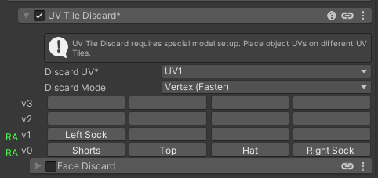

# Poiyomi UV Tile Labels

Adds per-material custom names for the buttons in Poiyomi Toon's **UV Tile Discard** and **Face Discard** 4x4 grids. Visual-only — the underlying `_UDIMDiscardRow*_*` shader properties are untouched.

Supports Poiyomi Toon 8.0 through 9.3. On 8.0–9.1 the stock UI was bare unlabelled checkboxes (no per-tile labels possible); after patching, those shaders also render the same 4-toggle-button row with custom labels.

## Patching

The patch is applied manually via menu — nothing runs automatically.

- **Cam → AI Slop → Poiyomi UV Tile Discard Labels → Apply Patch** — swaps `ThryMultiFloatButtons` / `ThryMultiFloats` to `ThryNamedTile*` across every Poi shader file under `Packages/com.poiyomi.toon/_PoiyomiShaders/Shaders/**` and/or `Packages/com.poiyomi.pro/_PoiyomiShaders/Shaders/**` — whichever is installed.
- **Cam → AI Slop → Poiyomi UV Tile Discard Labels → Revert Patch** — reverses the swap back to stock.

If VCC reinstalls Poiyomi, the patch is wiped and you must hit **Apply Patch** again.

## Usage (after patching)

- Select a material using Poiyomi Toon.
- Expand **Special FX → UV Tile Discard** (or its **Face Discard** sub-grid — Face Discard exists on 9.1 and newer).
- Right-click any tile button → **Rename...** → enter your label (e.g. `Hat`).
- Labels persist in the `.mat` file as material override tags. Multi-selecting materials before rename applies the new label to all of them.
- Right-click → **Reset to default** to revert a button to its `u0` / `v0` label.

## How it works

- `Editor/ThryNamedTileButtonsDrawer.cs` defines two custom `MaterialPropertyDrawer` classes (`ThryNamedTileButtons` for Poi 9.2+, `ThryNamedTileFloats` for Poi 8.0–9.1). Both render a 4-toggle-button row and resolve each button's label from a material override tag (`_CamTileLabel_<propertyName>`), falling back to blank when no tag is set. Right-click on a button shows Rename / Reset.
- Each row's left-side label (e.g. `v3`, `v2`) is kept narrow so the 4-button grid takes up nearly the full inspector row. Hovering the row label shows the tooltip "Right-click any tile button to rename it".
- If Thry's editor state can't be reached, or the drawer throws for any reason, it falls back to 4 plain `EditorGUI.Toggle` controls bound directly to the underlying float properties. The inspector remains usable — you just don't see custom labels in that mode.
- `Editor/PoiyomiTileLabelsPatcher.cs` exposes the menu items. It globs every `.shader` file under Poi's Shaders folder and does an idempotent regex swap of the drawer attribute names — only on `_UDIM*` properties, so other usages of `ThryMultiFloatButtons` / `ThryMultiFloats` in Poi's UI are left alone.
- If the patcher can't find Poi, finds UDIM grids in a drawer format it doesn't recognise (e.g. a future Poi version), or is asked to act when already in the target state, it surfaces a Unity dialog explaining what it found and writes nothing to disk.

## Removal

1. Run **Cam → AI Slop → Poiyomi UV Tile Discard Labels → Revert Patch** (restores shader files to stock).
2. Delete this folder (`Assets/!Cam/Tools/PoiyomiTileLabels/`).

Skipping step 1 isn't catastrophic — once the drawer code is gone, the `ThryNamedTile*` attributes in the shader files will fail to resolve and Unity will fall back to the default drawer. Reverting first is just cleaner.
